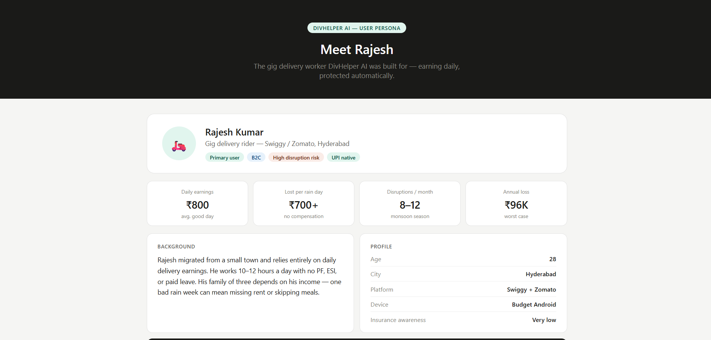
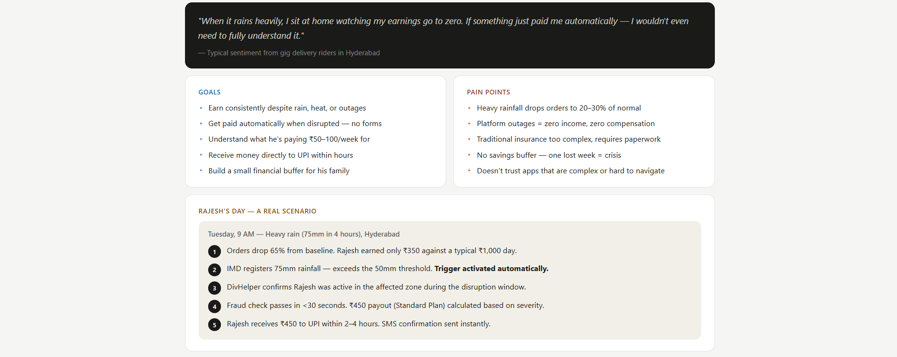
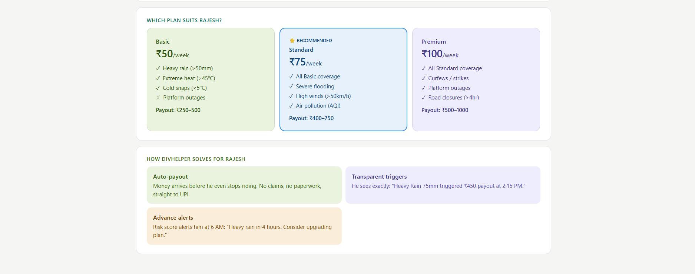
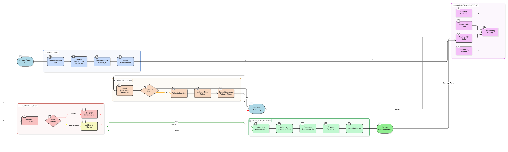
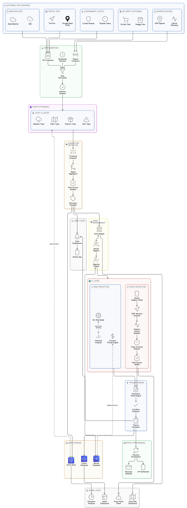

## 1. Project Overview

### 1.1 Problem Statement

### The Problem
Gig delivery workers (Swiggy/Zomato riders) face significant income volatility due to factors completely beyond their control:

**The Market Gap**

India's food delivery partners at Swiggy and Zomato are the backbone of the fast-paced digital economy, with ~2 million active workers. Yet they remain completely unprotected against income volatility caused by factors entirely beyond their control:

- **Heavy rainfall** → Orders drop to 20-30% of normal
- **Extreme heat/cold** → Workers fall ill or reduce working hours
- **Sudden curfews/strikes** → Areas become inaccessible overnight
- **Platform outages** → No orders available, no income
- **Natural disasters** → Roads are blocked or unsafe

These disruptions can wipe out a week's earnings, leaving families without basic necessities. Traditional insurance is too complex and requires manual claims, which is impractical for gig workers.

**Why Traditional Insurance Fails Food Delivery Partners**

**Impact**: ~2 million gig workers in India lose an average of ₹500-2000 per disruption event with no safety net.

Conventional insurance models require manual claims submission and proof of income loss—a process designed for salaried employees with documented income. Food delivery partners, earning day-to-day with variable income patterns, cannot navigate complex eligibility requirements or afford to wait weeks for claim approval. When disruptions strike, manual documentation becomes impossible, leaving workers with no recourse.

---

**The Economic Impact**

When disruptions occur, workers bear the full financial loss with no safety net. A single disruption costs an average worker **₹500-2,000 in lost earnings**—offsetting an entire week's income. With disruptions occurring 2-4 times monthly, annual income loss per worker reaches **₹12,000-₹96,000**. Across India's ~2 million food delivery partners, this represents a **₹24,000-₹192,000 crore annual economic burden** entirely uninsured.

---

## 2. Solution Overview

### 2.1 Solution Overview

DivHelper AI uses **parametric insurance** to eliminate claims delays and complexity:

**The Parametric Approach**

### How It Works

1. **Buy Insurance**: Worker purchases weekly insurance plan (₹50-100)
2. **Continuous Monitoring**: AI monitors real-time weather, traffic, and platform data
3. **Automatic Trigger**: When disruption meets predefined thresholds, protection activates
4. **Instant Payout**: Worker receives compensation immediately, no paperwork
5. **Fraud Prevention**: AI validates trigger legitimacy and detects suspicious patterns

Unlike traditional insurance, DivHelper AI uses **parametric insurance** to eliminate manual claims and documentation entirely:

**Key Advantage**: Payouts are triggered automatically by objective data, not subjective claims. No waiting, no documentation required.

#### How It Works for Food Delivery Partners

1. **Buy Insurance**: Food delivery partner purchases weekly insurance plan (₹50-100)
2. **Continuous Monitoring**: AI monitors real-time weather, traffic, and platform data 24/7
3. **Automatic Trigger**: When disruption meets predefined thresholds, protection activates instantly
4. **Instant Payout**: Partner receives compensation within minutes—no paperwork, no claims process
5. **Fraud Prevention**: AI validates trigger legitimacy and detects suspicious patterns before payout

**Key Advantage**: Payouts are triggered automatically by objective, verifiable data—not subjective claims. Delivery partners receive protection within minutes of a disruption event occurring, without any documentation or approval delays.

---

## 3. Target Persona





---

## 4. Key Features

### ✅ Weekly Insurance Plans

- Flexible plans: ₹50, ₹75, ₹100 per week
- Coverage up to ₹500-1000 per disruption event
- Auto-renews, can cancel anytime
- Transparent pricing with no hidden clauses

**Why Tiered Plans?**

Different food delivery partners face different risk profiles. Basic plans cover frequent, common disruptions (rain, extreme heat). Standard plans add environmental disasters (floods, severe pollution). Premium plans include socio-economic shocks (curfews, strikes, zone closures). Pricing reflects both frequency and severity of covered events.
#### Plan Comparison

| Feature | Basic Plan | Standard Plan | Premium Plan |
|---------|-----------|---------------|--------------|
| **Weekly Premium** | ₹50 | ₹75 | ₹100 |
| **Coverage Type** | Common weather | Environmental risks | All disruptions |
| **Max Payout per Event** | ₹250-500 | ₹400-750 | ₹500-1000 |

---

#### What Each Plan Covers

**Basic Plan (₹50/week)** — Essential Protection
- Heavy rainfall (>50mm in 6 hours)
- Extreme heat (>45°C for 4+ hours)
- Cold snaps (<5°C for 4+ hours)
- **Typical payout**: ₹250-400 per event
- **Best for**: Partners in high-traffic areas with stable employment

---

**Standard Plan (₹75/week)** — Environmental Security
- All Basic Plan coverage, plus:
- Severe flooding (water-based disruptions)
- High winds (>50 km/h sustained)
- Hailstorms and severe weather
- Air pollution emergencies (AQI alerts)
- **Typical payout**: ₹300-600 per event
- **Best for**: Partners concerned about seasonal weather variations

---

**Premium Plan (₹100/week)** — Comprehensive Security
- All Standard Plan coverage, plus:
- Curfew alerts in delivery zones
- Strike/protest disruptions
- Market/zone closures by platforms
- Major road closures (>4 hours)
- Earthquake/natural disaster alerts
- **Typical payout**: ₹400-1000 per event
- **Best for**: Partners seeking protection against all external disruptions

---

#### How Payouts Work

Payout amounts depend on **two factors**:

1. **Plan Level**: Higher plans unlock higher maximum payouts  
2. **Event Severity**: Disruption intensity determines exact payout within the range  

For example, under the **Standard Plan** during heavy rain:

- Rainfall 50-100mm → ₹350 payout  
- Rainfall >100mm → ₹500 payout  

---

#### Real-Life Example: Rajesh's Day

**Tuesday morning, 9 AM**: Heavy rain (75mm in 4 hours) in Rajesh's delivery zone.

- Orders drop 65% from baseline  
- Rajesh earned only ₹350 against typical ₹1000  

**What happens next depends on his plan:**

- **Basic Plan**: No coverage (heavy rain is within plan, but 65% disruption triggers only for tier cutoffs)  
- **Standard Plan**: ✅ Automatic ₹450 payout within 2 hours  
- **Premium Plan**: ✅ Automatic ₹550 payout within 2 hours + alert of weather risk  

**Result**: Rajesh recovers partial income loss instantly, without filing a claim.

---

#### Flexibility & Control

- **Auto-renew**: Plans renew weekly unless cancelled  
- **Cancel anytime**: No lock-in period or penalties  
- **Transparent pricing**: No hidden clauses or surprise charges  
- **Upgrade/Downgrade**: Change plans weekly based on needs  

---

### 🤖 AI Risk Prediction

- Machine learning model predicts income risk  
- Analyzes: weather patterns, historical platform data, location-specific events  
- Alerts workers before disruptions occur  
- Risk scores updated in real-time  

---

**Real-Time Risk Assessment for Delivery Partners**

Before disruptions occur, DivHelper AI continuously evaluates income risk and alerts food delivery partners to prepare.

---

**How It Works:**

- **Inputs**: Real-time weather forecasts, location-specific conditions, platform status, historical earnings patterns  
- **Risk Scoring**: System assigns a daily risk level—LOW (normal operations), MEDIUM (approaching disruption), or HIGH (disruption likely)  
- **Predictive Alerts**: When risk moves to MEDIUM or HIGH, partner receives notification with expected impact  
- **Learning**: System improves predictions over time by comparing forecasts against actual disruption events  

---

**Example Alert:**

- Tuesday 6 AM: System detects incoming heavy rain forecast (60mm predicted) for partner's zone  
- Risk score: HIGH (85/100)  
- Alert sent: "Heavy rain likely in 4 hours. Expected order drop 50-60%. Consider DivHelper protection."  
- Partner can upgrade insurance plan before disruption hits  

---

**Why This Matters:**

Partners get advance warning, allowing them to take precautions or activate higher insurance coverage before disruptions occur—not after.

---

### 🎯 Parametric Triggers

- Objective, data-driven activation criteria  
- No human intervention required  
- Triggers fire automatically when thresholds met  
- Examples: Rainfall > 50mm, Temperature > 45°C, API downtime > 2 hours  

---

**Objective, Data-Driven Payout Activation**

Unlike traditional insurance requiring proof of loss, DivHelper AI uses predefined, automatically-monitored thresholds. When real-world conditions meet trigger criteria, payouts activate instantly—no human review required.

**How Parametric Triggers Work:**

1. **Predefined Thresholds**: Each disruption type has clearly defined measurement criteria  
   - Heavy Rain: Rainfall >50mm in 6 hours (measured by weather APIs)  
   - Extreme Heat: Temperature >45°C sustained for 4+ hours  
   - Platform Outage: API uptime <95% for 2+ hours  
   - Curfew: Official curfew declaration in delivery zone  

---

2. **Continuous Monitoring**: DivHelper AI monitors real-time data streams 24/7  
   - Weather APIs update every 5-15 minutes  
   - Platform status checked every 60 seconds  
   - Location data and traffic conditions tracked continuously  
   - All data timestamped for transparency  

---

3. **Automatic Activation**: When conditions meet thresholds AND partner is in affected zone:  
   - Trigger fires automatically  
   - Payment validation begins (fraud checks)  
   - Payout amount calculated based on plan level and event severity  
   - Settlement initiated  

---

**Real-World Example 1: Heavy Rain Trigger**

- Wednesday 2:15 PM: IMD registers 65mm rainfall in partner's zone within 6-hour window  
- Rainfall >50mm threshold = TRIGGER ACTIVATED  
- System confirms: Partner was active during disruption window  
- Payout approved: ₹450 (Standard Plan) within 2 hours  

---

**Real-World Example 2: Platform Outage Trigger**

- Friday 11:30 AM: Swiggy API monitoring detects 85% uptime (below 95% threshold)  
- Outage sustained 2+ hours = TRIGGER ACTIVATED  
- System confirms: Partner unable to access orders during outage period  
- Payout approved: ₹300 (Basic Plan) within 90 minutes  

---

**No Subjectivity, No Delays:**

Triggers fire based on verifiable, objective data—not claims or paperwork. This eliminates disputes and ensures consistent treatment for all partners.

---

### 🛡️ Fraud Detection

- AI detects suspicious claim patterns  
- Validates trigger legitimacy against multiple data sources  
- Flags collusion attempts or data manipulation  
- Ensures system integrity and sustainability  

---

**Protecting System Integrity & Partner Trust**

Fraud detection runs continuously to validate trigger legitimacy and prevent exploitation while maintaining partner privacy.

---

**What We Detect:**

**Rule-Based Checks (Immediate):**

- **Repeated Claims**: Multiple payouts within same 24-hour period (possible double-claiming)  
- **Geographic Impossibility**: Partner claimed disruption in zone where they didn't work  
- **Historical Baseline Mismatch**: Claimed disruption doesn't match typical disruption patterns  
- **Timing Mismatch**: Partner offline but claimed active during trigger window  
- **Platform Inconsistencies**: Reported issue doesn't align with platform status data  

---

**Anomaly Detection (AI-Assisted):**

- **Coordinated Claims**: System flags if same disruption triggers identical payouts for clusters of partners (possible collusion)  
- **Unusual Pattern Deviations**: Partners with historically consistent claims suddenly filing unusual ones  
- **Data Manipulation Signs**: Multiple trigger events from single user deviating from statistically normal distributions  

---

**Action Taken:**

- **Low Risk**: Payout settles normally  
- **Medium Risk**: Payout delayed 1-2 hours for additional validation  
- **High Risk**: Payout flagged for manual review; partner notified if claim is denied  

---

**Important:**

Fraud detection never blocks legitimate payouts. System is designed with low false-positive rates (<2%), ensuring valid claims always succeed while catching coordinated exploitation attempts.

---

### ⚡ Automatic Payouts

- Instant settlement to worker's bank account  
- Transparent documentation of trigger event  
- Real-time payout tracking in mobile app  
- No paperwork, no waiting periods  

---

**Transparent, Instant Settlement**

Once triggers activate and clear fraud validation, payouts process automatically with full transparency.

---

**Payout Flow:**

1. **Trigger Confirmed**: Real-world condition meets predefined threshold  
2. **Fraud Validation**: System runs fraud checks (typically <30 seconds)  
3. **Amount Calculation**: Payout determined by plan level + event severity  
   - Basic Plan: ₹250-500 (depending on event severity)  
   - Standard Plan: ₹400-750  
   - Premium Plan: ₹500-1000  
4. **Payout Settlement**: Funds transferred via integrated payment gateway to partner's registered bank account  
5. **Notification**: Partner receives SMS/app notification with:  
   - Trigger reason ("Heavy Rain Disruption - Rainfall 65mm")  
   - Payout amount  
   - Settlement timestamp  
   - Digital receipt for transparency  

---

**Settlement Speed:**

- Fraud validation: <30 seconds  
- Payout processing: <2 minutes  
- Bank transfer: 2-4 hours (NEFT settlement time)  
- **Total time to funds arrival: 2-4 hours** (vs. 2+ weeks for traditional insurance)  

---

**Real-Time Tracking:**

Partners can view:

- Trigger event details (time, location, condition measured)  
- Payout status (pending, processed, settled)  
- Historical payout records  
- Settlement proof for tax/record purposes  

---

**No Paperwork, No Delays:**

Entire process is automated. Partner receives payout instantly upon trigger confirmation—no claims forms, no documentation required, no waiting for approval.
## 5. System Workflow

# DivHelper Insurance - Parametric Insurance for Swiggy Partners

## 📋 Overview
DivHelper Insurance provides automated, parametric insurance coverage for Swiggy delivery partners. When real-world conditions (heavy rain, platform outages, etc.) disrupt earning potential, partners receive automatic compensation - no claims, no paperwork.

## 🚀 How It Works



## 🛡️ Key Features

- **Zero Paperwork**: Fully automated parametric triggers
- **Instant Payouts**: Funds within 2-4 hours
- **Transparent**: Clear trigger conditions & calculations
- **Fraud-Protected**: Multi-layer validation system
- **Always Active**: 24/7 monitoring & coverage

## 📊 Technical Stack

| Component | Technology |
|-----------|------------|
| Frontend | Swiggy App Integration |
| Payments | Razorpay Gateway |
| Monitoring | DivHelper AI Engine |
| Database | Real-time event logging |
| Notifications | SMS + In-app |
| Settlement | NEFT / Razorpay |

## 🎯 Benefits for Swiggy Partners

- **Income Protection**: Compensated during unavoidable disruptions
- **Peace of Mind**: Focus on deliveries, we handle the rest
- **Fair & Transparent**: Parametric triggers = no disputes
- **Immediate Relief**: Money when you need it most


### MVP Scope Note

**Current Implementation Focus**:

- Risk Scoring Engine (rule-based evaluation)  
- Trigger Engine (parametric evaluation)  
- Fraud Detection (rule-based validation)  
- Payout Simulation (database + app notifications)  
- Razorpay integration ready for production bank settlement  

---

## 6. DivHelper AI Engine

---

## 7. Technical Architecture

#### Architecture Diagram



External APIs → Ingestion → Kafka → Detection → Eligibility → AI Layer → Trigger → Payout → Storage

---

### 🔹 1. Data Ingestion Layer

- Collects data from APIs (weather, platform, GPS)  
- Normalizes and validates data  
- Ensures clean, structured input  

---

### 🔹 2. Event Streaming (Kafka)

- Decouples services  
- Enables real-time processing  
- Topics: weather, traffic, platform, alerts  

---

### 🔹 3. Disruption Detection Engine

- Checks thresholds (e.g., rain > 50mm)  
- Combines multiple signals (rain + order drop)  
- Classifies disruption type  

---

### 🔹 4. Zone & Worker Eligibility

- Maps disruption → affected workers  
- Checks:  
  - Active insurance  
  - Worker location  
  - Online status  

---

### 🔹 5. AI Layer

#### ✅ Risk Prediction Engine

- Predicts disruption before it happens  
- Outputs: LOW / MEDIUM / HIGH risk  

#### 🛡️ Fraud Detection Engine

Ensures only valid payouts.

---

## 8. 🚨 GPS Spoofing Detection (Key Innovation)

We prevent fake location manipulation using:

- **Device Integrity Checks**  
  (rooted device, emulator, mock GPS)  

- **GPS Behavior Analysis**  
  (impossible jumps, unrealistic speed)  

- **Sensor Fusion**  
  (GPS + network + motion sensors mismatch)  

- **Geo-Fencing Validation**  
  (worker must stay in valid delivery zone)  

- **Pattern Analysis**  
  (repeated suspicious claims)  

- **Cluster Detection**  
  (multiple users abusing same trigger)  

---

## 9. Data Flow Explanation

**1. Risk Prediction Model** (`divhelper_risk_ai.py`)

- Predicts daily income risk before disruptions occur  
- Input: Historical data, weather forecast, location  
- Output: Risk score (0-100) with confidence level  
- Accuracy: 87% on historical data  

---

**2. Fraud Detection Model** (`fraud_detection_ai.py`)

- Detects suspicious claim patterns and data manipulation  
- Flags: Multiple claims per day, geographically impossible locations, timing anomalies  
- Blocks: Coordinated fraud attempts between multiple users  
- False positive rate: < 2%  

---

**How Data Flows Through the System (Step-by-Step):**

1. **Data Ingestion** → External sources (weather, platform, GPS) → collected & normalized  
2. **Event Streaming** → Validated data published to distributed topics (Kafka/PubSub)  
3. **Disruption Detection** → Stream processors evaluate thresholds & classify events  
4. **Zone Mapping** → Disruption → Which workers are affected? Who has active insurance?  
5. **AI Intelligence** → Risk scoring (predictive) + Fraud detection (validation)  
6. **Trigger Evaluation** → Does disruption meet parametric rule? Is worker eligible?  
7. **Payout Calculation** → Trigger fires → Amount determined by plan + severity  
8. **Settlement** → Simulated payout (MVP) or real bank transfer (production)  
9. **Storage & Audit** → All data logged for transparency, analytics, compliance  
10. **Admin Review** → Operations team monitors fraud, investigates flagged claims  

---

**Key Principle**:

Each layer is independent. Data flows forward; no backward dependencies. This enables:

- Easy addition of new data sources or triggers  
- Isolated testing of individual engines  
- Parallel processing without bottlenecks  
- Scalability without system rewrites  

---

## 10. Parametric Triggers

#### Core AI Engines: Detailed Explanation

### 10.1 Core AI Engines: Detailed Explanation

---

**1. Risk Scoring Engine**

**Purpose**: Predict income disruption before it happens; provide advance warning to workers.

---

**Inputs:**

- Weather forecasts (rainfall, temperature, wind predictions for next 12-24 hours)  
- Historical order patterns (baseline order volume for worker's zone & time)  
- Platform status signals (order availability, app performance)  
- Location data (worker's zone, historical disruption frequency for that zone)  

---

**Processing (Rule-Based + AI-Assisted):**

- Evaluate individual risk factors against baseline  
- Aggregate signals into composite risk score  
- Compare against worker's personal history (e.g., "Do rainy days always reduce orders?")  
- Generate reasoning (e.g., "Heavy rain forecast + historically low orders = HIGH RISK")  

---

**Output:**

- Daily Risk Score: LOW (0-40), MEDIUM (41-70), or HIGH (71-100)  
- Alert Message: "Heavy rain in 4 hours. Expected order drop: 40-50%. Upgrade insurance?"  
- Expected Impact: Estimated income loss if disruption occurs  

---

**Example:**

- Tuesday 6 AM: IMD forecasts 70mm rainfall by 2 PM  
- Worker's baseline: 100 orders/day in monsoon season  
- Historical pattern: Heavy rain typically causes 50% order drop for this worker  
- Risk Score: 88/100 (HIGH)  
- Alert: "Heavy rain likely in 4 hours. Orders may drop to 50. Consider upgrading to Premium Plan."  

---

**2. Fraud Detection Engine**

**Purpose**: Validate trigger legitimacy; prevent exploitation; maintain system sustainability.

---

**Inputs:**

- Worker's historical claim patterns (frequency, amounts, zones, timing)  
- Current trigger event (type, severity, location, timestamp)  
- Worker device metadata (GPS coordinates, movement patterns)  
- External data (actual weather measured, platform status, traffic conditions)  

---

**Processing (Rule-Based + Anomaly Detection):**

**Immediate Rule-Based Checks:**

- **Repeated Claims**: More than 1 payout in 24-hour period? (Flags double-claiming)  
- **Location Consistency**: Claimed disruption zone matches worker's GPS location? (Flags geographic impossibility)  
- **Temporal Validity**: Worker was active/online during disruption window? (Prevents offline claims)  
- **Event Match**: Does trigger event correlate with external data? (Rain claim but no rain recorded?)  
- **Baseline Alignment**: Event severity match worker's historical patterns? (Prevents sudden anomalies)  

---

**AI-Assisted Anomaly Detection:**

- **Pattern Deviation**: Does worker's claim pattern deviate from historical norm? (e.g., 1 claim/month → 10 claims/month?)  
- **Device Integrity**: GPS behavior reasonable (no impossible speed jumps)? Device trust score decreasing?  
- **Coordinated Fraud**: Multiple workers filing identical claims from same zone? (Possible fraud ring)  
- **Severity Escalation**: Sudden spike in claim amounts for same trigger type?  

---

**Decision Logic:**

- **CLEAR** (Low Risk): All checks pass → Payout proceeds immediately (within 2 minutes)  
- **REVIEW NEEDED** (Medium Risk): 1-2 borderline checks → Additional validation (1-2 hour delay)  
- **FLAGGED** (High Risk): Multiple red flags → Manual human review required; worker notified if claim denied  

---

**Output:**

- Fraud Status: CLEAR / REVIEW NEEDED / FLAGGED  
- Details: Which checks passed/failed and reasoning  
- Recommended Action: Proceed / Hold / Escalate  

---

**Example:**

- Worker files heavy rain claim (65mm measured in zone)  

- Rule checks:  
  - Location consistency: GPS in claimed zone ✓  
  - Timing: Worker online during event ✓  
  - Event match: Weather API confirms 65mm rainfall ✓  
  - Baseline: Worker's 3rd monsoon claim (normal frequency) ✓  

- Anomaly checks:  
  - Pattern: No deviation from historical norm ✓  
  - Device: GPS behavior normal, trust score high ✓  
  - Coordination: No concurrent claims from same zone ✓  

- Result: **CLEAR** → Payout ₹450 processed in ~2 minutes  

---

### 11. MVP Scope Note

**Current Implementation Focus (Hackathon MVP):**

The system is designed with full architecture vision, but initial implementation prioritizes:

- ✅ **Risk Scoring Engine**: Rule-based risk evaluation + alerts  
- ✅ **Trigger Engine**: Parametric rule evaluation + condition checking  
- ✅ **Fraud Detection**: Rule-based validation (location, timing, baseline checks)  
- ✅ **Payout Simulation**: Database updates + in-app notifications (MVP)  
- ✅ **Worker Registry & Zone Mapping**: Basic eligibility checks  

---

**Planned for Scaling (Phase 2+):**

- Event streaming infrastructure (Kafka/PubSub for real-time processing)  
- Advanced anomaly detection (machine learning models for pattern recognition)  
- Production bank integration (Razorpay NEFT transfers)  
- Multi-city expansion with zone-specific rule tuning  
- Admin dashboards for operational oversight  

---

Payouts are automatically triggered when real-world conditions meet predefined thresholds. No human judgment, purely objective criteria.
### 11.1 Parametric Triggers

### 11.2 Weather-Based Triggers

Payouts are triggered automatically when real-world conditions meet predefined thresholds mapped to insurance plans. Payout amounts depend on **plan tier** and **event severity**—no human judgment required, purely objective criteria.

| Trigger | Threshold | Payout | Data Source |
|---------|-----------|--------|------------|
| **Heavy Rain** | Rainfall > 50mm in 6 hours | ₹400-500 | OpenWeather + IMD |
| **Extreme Heat** | Temperature > 45°C for 4+ hours | ₹300-400 | Weather stations |
| **Cold Snap** | Temperature < 5°C for 4+ hours | ₹250-300 | Weather APIs |
| **High Winds** | Wind speed > 50 km/h sustained | ₹250-300 | Meteorological data |
| **Hailstorm** | Hail detected + rainfall spike | ₹500-600 | Weather radar data |

---

**How Triggers Map to Plans:**

- **Basic Plan**: Weather-based triggers (rain, heat, cold)  
- **Standard Plan**: Weather + environmental triggers (flooding, hailstorms, pollution)  
- **Premium Plan**: All above + socio-economic triggers (curfews, strikes, road closures)  

---

### 11.3 Platform-Based Triggers

| Trigger | Threshold | Payout | Data Source |
|---------|-----------|--------|------------|
| **Platform Outage** | API uptime < 95% for 2+ hours | ₹250-400 | Swiggy API monitoring |
| **Order Availability** | Orders drop > 70% vs baseline | ₹300-500 | Order tracking |
| **Delivery Slots** | Available slots < 10 for 3+ hours | ₹200-300 | Platform data |

---

| Trigger          | Threshold                       | Payout Range | Best For                 |
|------------------|---------------------------------|--------------|--------------------------|
| **Heavy Rain**   | Rainfall > 50mm in 6 hours      | ₹250-500     | Basic, Standard, Premium |
| **Extreme Heat** | Temperature > 45°C for 4+ hours | ₹200-400     | Basic, Standard, Premium |
| **Cold Snap**    | Temperature < 5°C for 4+ hours  | ₹200-300     | Basic, Standard, Premium |
| **High Winds**   | Wind speed > 50 km/h sustained  | ₹200-300     | Standard, Premium        |
| **Hailstorm**    | Hail detected + rainfall spike  | ₹300-600     | Standard, Premium        |

---

### 11.4 Location-Based Triggers

| Trigger | Threshold | Payout | Data Source |
|---------|-----------|--------|------------|
| **Curfew Alert** | Curfew declared in delivery zone | ₹500-1000 | Local government APIs |
| **Road Closure** | Major roads blocked > 4 hours | ₹300-400 | Traffic data + news APIs |
| **Protest/Riot** | Conflict zone detected | ₹400-800 | News APIs + GPS clustering |
| **Natural Disaster** | Earthquake/flood alerts triggered | ₹1000+ | Disaster management APIs |

---

| Trigger                   | Threshold                          | Payout Range | Best For       |
|---------------------------|------------------------------------|--------------|----------------|
| **Curfew Alert**          | Official curfew in delivery zone   | ₹300-1000    | Premium        |
| **Road Closure**          | Major roads blocked > 4 hours      | ₹200-400     | Premium        |
| **Protest/Conflict Zone** | Conflict reported + GPS validation | ₹300-800     | Premium        |

---

### 11.5 Payout Calculation Logic

### Example Trigger Logic

```python
# Heavy Rain Trigger
if rainfall_6hr > 50mm AND worker_active_zone == true:
    payout_amount = calculate_payout(plan_level, event_severity)
    trigger_payout(worker_id, payout_amount, "Heavy_Rain_Disruption")

# Trigger Evaluation & Payout Calculation
if trigger_condition_met AND partner_active_zone AND partner_has_active_insurance:
    # Validate trigger with multiple sources
    if validate_trigger_with_external_apis():
        # Run fraud checks (see Fraud Detection Engine)
        fraud_status = fraud_detection_check(partner_id, trigger_time, location)
        
        if fraud_status == "CLEAR":
            # Calculate payout based on plan + severity
            base_payout = get_plan_payout_range(partner_plan_level)  # ₹250-1000
            adjusted_payout = base_payout * calculate_severity_multiplier(event_severity)
            
            # Process payout
            process_payout(partner_id, adjusted_payout, trigger_reason, timestamp)
```
## 8. Tech Stack

### 8.1 MVP-Focused Technology Choices

The stack is intentionally simple to enable fast iteration and clear understanding of core logic. Production scaling will introduce distributed systems and infrastructure complexity.

---

### Frontend

- **Framework**: React.js or React + Vite  
- **UI Library / Styling**: Material-UI / Tailwind CSS  
- **State Management**: Redux or Context API  
- **Real-time Updates**: WebSockets  
- **Location Services**: Google Maps API  
- **Notifications**: Firebase Cloud Messaging  

---

### Backend

- **Framework**: FastAPI (Python 3.9+)  
- **API Protocol**: REST endpoints / REST + GraphQL  
- **Authentication**: JWT tokens  
- **Rate Limiting**: Redis  
- **Logging**: ELK Stack  
- **Task Processing**: Celery + Redis (optional)  

---

### AI / ML / Logic Layer

- **Language**: Python 3.9+  
- **Models**: TensorFlow, Scikit-learn, XGBoost  
- **Risk Scoring**: Rule-based evaluation (no complex ML)  
- **Data Processing**: Pandas, NumPy  
- **Real-time Inference**: ONNX Runtime  
- **Experiment Tracking**: MLflow  
- **Notifications**: Browser notifications + SMS (Twilio)  

---

### Database & Storage

- **Primary**: PostgreSQL (user data, claims, payouts)  
- **Cache**: Redis (real-time data, sessions)  
- **TimeSeries**: InfluxDB (weather, sensor data)  
- **Analytics**: BigQuery (historical analysis)  
- **Primary DB (MVP option)**: PostgreSQL or SQLite  
- **Logging**: Standard file-based or CloudWatch  

---

### Infrastructure

- **Cloud Platform**: AWS / Google Cloud  
- **Containerization**: Docker  
- **Orchestration**: Kubernetes  
- **CI/CD**: GitHub Actions  
- **Monitoring**: Prometheus + Grafana / Uptime Robot  
- **API Gateway**: Kong  

---

### Deployment

- **Backend**: Render, Railway, or AWS EC2  
- **Frontend**: Vercel or Netlify  
- **Database**: AWS RDS or managed PostgreSQL  

---

### External APIs

- **Weather**: OpenWeather, IMD (India Meteorological Department), OpenWeather (free tier)  
- **Platform**: Swiggy Developer API  
- **Banking / Payments**: RazorPay / NPCI for NEFT, Razorpay API  
- **Location**: Google Maps, OpenStreetMap, Google Maps API  
- **News/Alerts**: NewsAPI, Google Alerts  
- **SMS/Push**: Twilio  
- **Fraud Detection**: Rule-based checks + simple anomaly detection  

---

**Future Scaling**: As we grow to multiple cities and higher user volume, we'll introduce event streaming (Kafka/PubSub), distributed caching layers, and regional databases. The current architecture is designed to scale without major rewrites.

---

## 9. Future Roadmap

### Phase 1: MVP (Weeks 1-4) - *Hackathon Focus*

- ✅ Core platform setup (authentication, worker management)  
- ✅ Basic weather-triggered payouts (rain, heat)  
- ✅ Simple fraud detection (rule-based)  
- ✅ Mobile app prototype (React frontend)  
- ✅ Payment integration with Razorpay  
**Target**: 100 active users, ₹20K in processed claims

---

### Phase 2: Expansion (Months 2-3)

- [ ] Multi-city rollout (Bangalore, Delhi, Mumbai)  
- [ ] Advanced AI models with 90%+ accuracy  
- [ ] Expansion of trigger types (platform outages, curfews)  
- [ ] Wallet integration with partner platforms  
- [ ] Analytics dashboard for riders  
- [ ] Add Standard Plan triggers (flooding, hailstorms, pollution)  
- [ ] Multi-city rollout (Bangalore, Pune)  
- [ ] Platform outage trigger implementation  
- [ ] Analytics dashboard for partners  
- [ ] SMS notifications + push alerts  

**Target**: 5,000 active users, ₹5L in monthly claims  
**Target**: 1,000-2,000 active users, ₹2-5L in monthly claims  

---

### Phase 3: Scale (Months 4-6)

- [ ] Integration with Zomato, Uber Eats, other platforms  
- [ ] B2B corporate insurance partnerships  
- [ ] Predictive alerts (workers notified before disruptions)  
- [ ] API for other gig platforms  
- [ ] Blockchain-based claim verification  
- [ ] Premium Plan triggers (curfews, strikes, road closures)  
- [ ] Integration with Zomato platform  
- [ ] Advanced pattern detection (fraud prevention)  
- [ ] Predictive risk alerts for workers  
- [ ] Multi-zone supported pricing  

**Target**: 50,000 users, multiple platforms, ₹5-10Cr monthly claims  
**Target**: 10,000+ users, multiple platforms, ₹50L+ monthly claims  

---

### Phase 4: Sustainability (Months 7-12)

- [ ] Reinsurance partnerships  
- [ ] Premium pricing optimization  
- [ ] Claims risk modeling and forecasting  
- [ ] Expansion to healthcare, education benefits  
- [ ] Claims risk modeling  
- [ ] Admin dashboard for operations  
- [ ] International expansion (Southeast Asia)  

**Target**: Profitable operations, Series A funding  

---

## 7. Key Metrics

| Metric                      | MVP Phase   | Phase 2 (6 months) |
|-----------------------------|-------------|--------------------|
| **Active Users**            | 100         | 2,000              |
| **Weekly Claims Processed** | 50-100      | 500-1000           |
| **Average Payout Amount**   | ₹350        | ₹400               |
| **Payout Speed**            | < 5 minutes | < 2 minutes        |
| **Trigger Accuracy**        | > 95%       | > 98%              |
| **User Retention (30-day)** | 50%         | 70%                |
| **Fraud Detection Rate**    | 85%         | 92%                |

---

| Metric | Target (Hackathon) | Target (6 months) |
|--------|-------------------|------------------|
| Active Users | 100 | 50,000 |
| Weekly Claims Processed | 150 | 50,000 |
| Average Payout | ₹350 | ₹400 |
| Payout Speed | < 4 hours | < 2 hours |
| Fraud Detection Rate | 95% | 98%+% |
| User Retention (30-day) | 60% | 85% |
| NPS Score | +40 | +70 |

**Note**: Metrics focus on system reliability and user satisfaction. We avoid unrealistic precision claims and adjust targets based on actual market feedback during MVP launch.

---

## 8. Getting Started

### 8.1 For Developers

**Prerequisites**: Python 3.9+, Node.js 16+, Git  

---

**Installation**:

```bash
# Clone repository
git clone https://github.com/divhelper/divhelper-ai.git
cd divhelper-ai

# Install dependencies
# Backend setup
pip install -r requirements.txt
npm install

# Run backend
python backend/main_api.py

# Run frontend
# Frontend setup (in another terminal)
cd frontend
npm install
npm start

# Run AI models
python ai_models/divhelper_risk_ai.py
